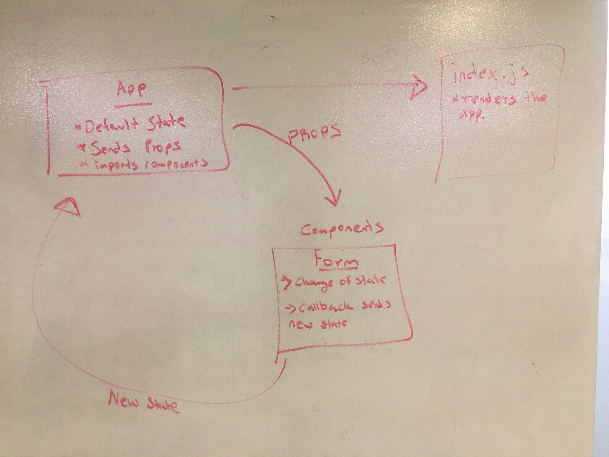

# LAB - 28-Props-and-State

### Author: Hanna Alemu

### Common npm Scripts
 "test": "react-scripts test --env=jsdom",
    "start": "react-scripts start",
    "build": "react-scripts build",
    "docs": "styleguidist server",
    "docs:build": "styleguidist build",
    "lint": "eslint src/**/*.js"

### Links and Resources

This repo contains the assignemt 3 files. Here are the rest of assignments I did on Code SandBox

* [Assignment-One-Part-One](https://codesandbox.io/s/lab-28-assignment-1-part-one-7xp00)
* [Assignment-One-Part-Two](https://codesandbox.io/s/lab-28-assignment-1-part-two-v0lzm)

* [Assignment-Two-Part-One](https://codesandbox.io/s/lab-28-assignment-2-internal-state-part-one-o1786)
* [Assignment-Two-Part-Two](https://codesandbox.io/s/lab-28-assignment-2-internal-state-part-two-fy1rc)

* [Assignment-Three-Part-One](https://codesandbox.io/s/lab-28-external-state-part-one-iblz5)
* [Assignment-Three-Part-Two](https://codesandbox.io/s/lab-28-external-state-part-two-lm71l)

* [submission PR](http://xyz.com)

* [travis](https://www.travis-ci.com/401-advanced-javascript-hanna-alemu/Lab-28-Props-and-State/)

* [Heroku](https://lab-28.herokuapp.com/)

#### Documentation

* [styleguide](http://xyz.com) (React assignments)

#### Running the app
* `npm start`
  
#### Tests
$ npm run test

#### UML

